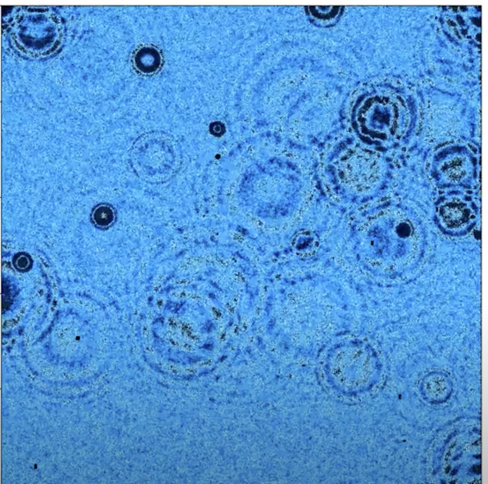

# Fluid Simulation

# Web Demo: 
Code avaliable on github static pag

Diffeq rewrite:

    

    

      

A simple ball simulation program implemented in C++ using SFML.
Red means balls going fast blue is slow.

## Video Demonstration
## NEW DEMO JUNE 24 https://www.youtube.com/watch?v=R2yFt4YDVbU

Check out the video demonstration of the project on YouTube: (click the image)
(too big to fit in gif)

